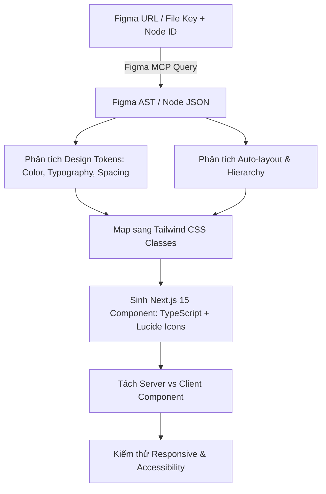

# Figma to Next.js Component Workflow (with MCP)

This skill guides the setup of **Figma MCP Server** and provides the systematic workflow for translating Figma designs into clean, responsive, and accessible **Next.js (App Router, Tailwind CSS, TypeScript)** components.

---

## 1. Cấu Hình Figma MCP Server (`mcp_config.json`)

Để Antigravity Agent có thể kết nối trực tiếp với file thiết kế Figma thông qua Model Context Protocol, cấu hình tại:
- **Global**: `~/.gemini/config/mcp_config.json` (tại `C:\Users\<User>\.gemini\config\mcp_config.json` trên Windows)
- Hoặc thông qua file cấu hình plugin.

```json
{
  "mcpServers": {
    "figma": {
      "command": "npx",
      "args": ["-y", "@modelcontextprotocol/server-figma"],
      "env": {
        "FIGMA_ACCESS_TOKEN": "YOUR_FIGMA_PERSONAL_ACCESS_TOKEN"
      }
    }
  }
}
```

> **Cách lấy Figma Personal Access Token**:
> 1. Mở Figma -> Click avatar góc trên trái -> **Settings**.
> 2. Chọn tab **Security** -> Kéo xuống **Personal access tokens**.
> 3. Click **Generate new token**, đặt tên (ví dụ: `Antigravity-MCP`), cấp quyền read-only cho files và copy token.

---

## 2. Quy Trình Trích Xuất & Chuyển Đổi (Figma to Code Pipeline)



### Bước 1: Trích xuất thông tin node từ Figma
Xác định URL của khung thiết kế cần cắt:
- Format URL: `https://www.figma.com/design/:file_key/:project_name?node-id=:node_id`
- Ví dụ: `fileKey = "aBcDeFgHiJ"`, `nodeId = "123:456"` (lưu ý đổi dấu `:` thành `-` nếu API yêu cầu).

### Bước 2: Bảng Ánh Xạ Auto-Layout Figma sang Tailwind CSS

| Thuộc tính Figma | Trạng thái Figma | Tailwind CSS Class |
| :--- | :--- | :--- |
| **Layout Direction** | Horizontal | `flex flex-row` |
| | Vertical | `flex flex-col` |
| **Alignment (Primary)** | Packed (Top / Left) | `justify-start` |
| | Center | `justify-center` |
| | Space Between | `justify-between` |
| **Alignment (Counter)** | Top / Left | `items-start` |
| | Center | `items-center` |
| | Bottom / Right | `items-end` |
| **Item Spacing (Gap)** | 8px / 16px / 24px | `gap-2` / `gap-4` / `gap-6` |
| **Padding** | Top, Right, Bottom, Left | `px-4 py-3`, `pt-2 pb-6`, v.v. |
| **Resizing** | Hug contents | `w-fit`, `h-fit` |
| | Fill container | `w-full`, `flex-1` |
| | Fixed width/height | `w-[320px]`, `h-12` |
| **Corner Radius** | 4px / 8px / 12px / 9999px | `rounded`, `rounded-lg`, `rounded-xl`, `rounded-full` |
| **Drop Shadow** | Blur 4px, Y: 2px | `shadow-sm`, `shadow-md`, `shadow-lg` |

---

## 3. Tiêu Chuẩn Viết Component Cho Next.js (Project TOEIC)

Khi chuyển giao diện từ Figma sang `frontend/src/`:

1. **Phân định rõ RSC và Client Component**:
   - Component hiển thị tĩnh (Cards, Header, Layout, Typography): Để mặc định **React Server Component (RSC)**.
   - Component có tương tác (Nút bấm, Timer, Audio Player, Modal, Input form): Thêm `'use client'` ở đầu file.
2. **Icon & Media**:
   - Sử dụng thư viện icon hiện đại [lucide-react](https://lucide.dev) thay vì nhúng raw SVG cồng kềnh (ví dụ: `Play`, `Pause`, `Bookmark`, `CheckCircle`, `Clock`).
   - Hình ảnh (Ảnh Part 1, Part 7) sử dụng `next/image` với responsive attributes (`sizes`, `priority` nếu above the fold).
3. **TypeScript Props**:
   - Định nghĩa `interface Props` rõ ràng với JSDoc cho các props quan trọng.

---

## 4. Code Template Mẫu: Chuyển Đổi Card Câu Hỏi TOEIC

Giả sử trích xuất một Frame câu hỏi Part 5 từ Figma:

```tsx
'use client';

import React from 'react';
import { Bookmark, HelpCircle } from 'lucide-react';

interface QuestionOption {
  key: 'A' | 'B' | 'C' | 'D';
  content: string;
}

interface QuestionCardProps {
  questionNumber: number;
  partNumber: number;
  content: string;
  options: QuestionOption[];
  selectedOption?: string;
  onSelectOption: (key: string) => void;
  isBookmarked?: boolean;
  onToggleBookmark?: () => void;
}

export const QuestionCard: React.FC<QuestionCardProps> = ({
  questionNumber,
  partNumber,
  content,
  options,
  selectedOption,
  onSelectOption,
  isBookmarked = false,
  onToggleBookmark,
}) => {
  return (
    <div className="flex flex-col gap-6 rounded-2xl border border-slate-200 bg-white p-6 shadow-sm transition-all hover:shadow-md dark:border-slate-800 dark:bg-slate-900">
      {/* Header */}
      <div className="flex items-center justify-between">
        <div className="flex items-center gap-3">
          <span className="flex h-8 items-center justify-center rounded-lg bg-indigo-50 px-3 text-sm font-semibold text-indigo-600 dark:bg-indigo-950/50 dark:text-indigo-400">
            Part {partNumber}
          </span>
          <span className="text-sm font-medium text-slate-500">
            Câu {questionNumber} / 200
          </span>
        </div>
        <button
          onClick={onToggleBookmark}
          className={`rounded-lg p-2 transition-colors ${
            isBookmarked
              ? 'text-amber-500 bg-amber-50 dark:bg-amber-950/40'
              : 'text-slate-400 hover:bg-slate-100 hover:text-slate-600 dark:hover:bg-slate-800'
          }`}
          title="Đánh dấu câu hỏi"
        >
          <Bookmark className="h-5 w-5 fill-current" />
        </button>
      </div>

      {/* Question Content */}
      <p className="text-base font-medium leading-relaxed text-slate-900 dark:text-slate-100">
        {content}
      </p>

      {/* Options List */}
      <div className="grid grid-cols-1 gap-3 sm:grid-cols-2">
        {options.map((option) => {
          const isSelected = selectedOption === option.key;
          return (
            <button
              key={option.key}
              onClick={() => onSelectOption(option.key)}
              className={`flex items-center gap-4 rounded-xl border p-4 text-left transition-all ${
                isSelected
                  ? 'border-indigo-600 bg-indigo-50/50 ring-2 ring-indigo-600/20 dark:border-indigo-500 dark:bg-indigo-950/30'
                  : 'border-slate-200 hover:border-slate-300 hover:bg-slate-50/50 dark:border-slate-800 dark:hover:border-slate-700 dark:hover:bg-slate-800/50'
              }`}
            >
              <span
                className={`flex h-7 w-7 shrink-0 items-center justify-center rounded-full text-xs font-bold ${
                  isSelected
                    ? 'bg-indigo-600 text-white'
                    : 'bg-slate-100 text-slate-700 dark:bg-slate-800 dark:text-slate-300'
                }`}
              >
                {option.key}
              </span>
              <span className="text-sm font-medium text-slate-800 dark:text-slate-200">
                {option.content}
              </span>
            </button>
          );
        })}
      </div>
    </div>
  );
};
```

---

## 5. Checklist Kiểm Định Sau Khi Chuyển Đổi

- [ ] **Pixel-Ratio & Spacing**: Đã kiểm tra khoảng cách `padding`, `gap`, `margin` tương ứng với bội số của 4px (Tailwind standard).
- [ ] **Dark Mode Support**: Hỗ trợ đầy đủ biến thể màu tối (`dark:bg-*`, `dark:text-*`, `dark:border-*`).
- [ ] **Interactive States**: Đã bổ sung hiệu ứng `hover:`, `active:`, `focus-visible:ring-2`, và `disabled:opacity-50`.
- [ ] **Mobile Responsive**: Đã kiểm tra breakpoint `sm:`, `md:`, `lg:` để giao diện không bị tràn trên màn hình điện thoại.
