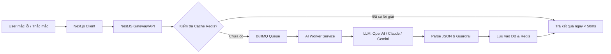
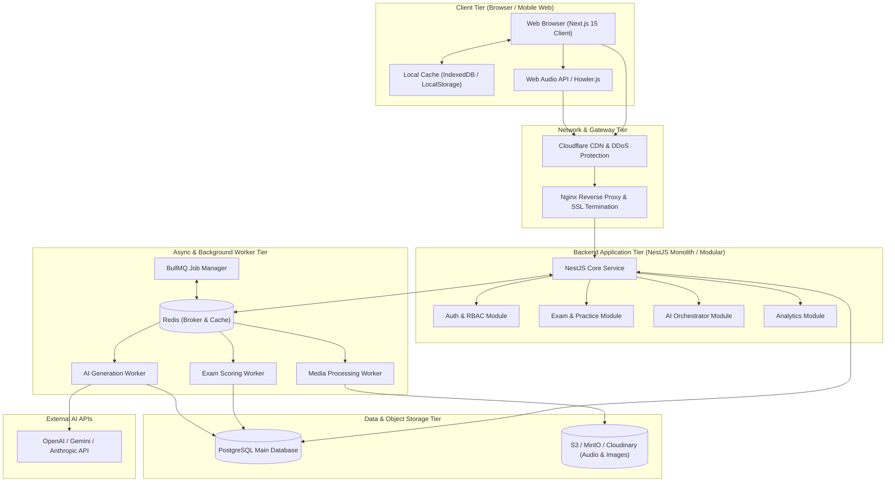
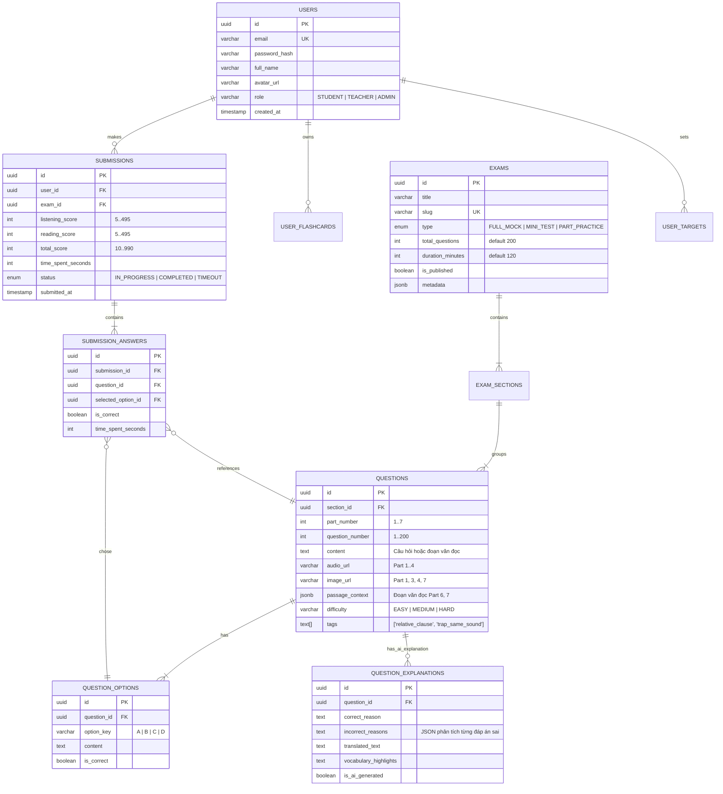
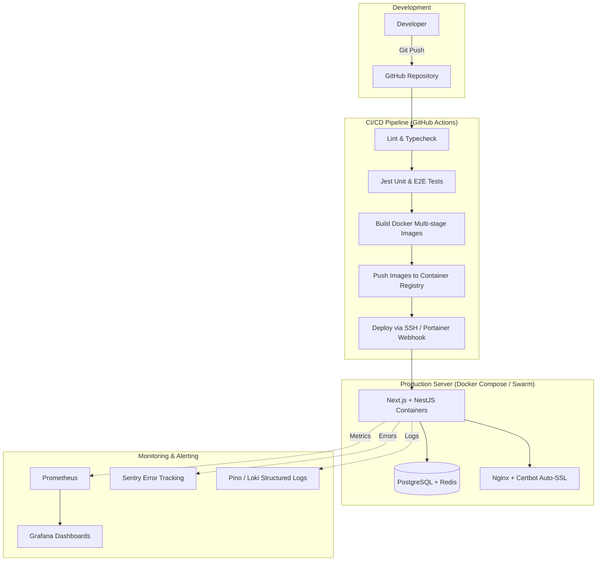
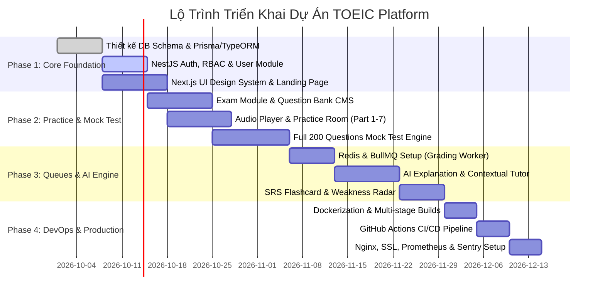

# 📘 TÀI LIỆU YÊU CẦU DỰ ÁN VÀ THIẾT KẾ KIẾN TRÚC HỆ THỐNG
# (PROJECT REQUIREMENTS & SYSTEM ARCHITECTURE SPECIFICATION)

> **Dự án**: Nền Tảng Luyện Thi TOEIC Thông Minh (Adaptive TOEIC Prep Platform with AI)  
> **Phiên bản**: 1.0.0  
> **Trạng thái**: Approved / Architecture Baseline  
> **Tech Stack**: Next.js • NestJS • PostgreSQL • Redis & BullMQ • AI Engine • Docker & CI/CD  

---

## 📑 MỤC LỤC
1. [TỔNG QUAN DỰ ÁN (PROJECT OVERVIEW)](#1-tổng-quan-dự-án-project-overview)
2. [ĐỐI TƯỢNG SỬ DỤNG & PERSONAS](#2-đối-tượng-sử-dụng--personas)
3. [YÊU CẦU CHỨC NĂNG (FUNCTIONAL REQUIREMENTS)](#3-yêu-cầu-chức-năng-functional-requirements)
   - 3.1. Authentication & User Management
   - 3.2. Ngân Hàng Đề & Practice Mode (Parts 1 - 7)
   - 3.3. Full Mock Test Engine (Mô Phỏng ETS 200 Câu)
   - 3.4. Hệ Thống AI Thực Tế (Practical AI Features)
   - 3.5. Gamification, SRS Flashcard & Analytics
   - 3.6. Quản Trị Hệ Thống (CMS / Admin Portal)
4. [YÊU CẦU PHI CHỨC NĂNG (NON-FUNCTIONAL REQUIREMENTS)](#4-yêu-cầu-phi-chức-năng-non-functional-requirements)
5. [THIẾT KẾ KIẾN TRÚC HỆ THỐNG (SYSTEM ARCHITECTURE)](#5-thiết-kế-kiến-trúc-hệ-thống-system-architecture)
   - 5.1. High-Level Architecture
   - 5.2. Frontend Architecture (Next.js)
   - 5.3. Backend Architecture (NestJS)
   - 5.4. Database Schema Design (PostgreSQL)
   - 5.5. Hàng Đợi & Xử Lý Bất Đồng Bộ (Redis & BullMQ)
   - 5.6. AI Service Integration & Prompt Engineering
   - 5.7. DevOps, CI/CD & Monitoring
6. [LỘ TRÌNH TRIỂN KHAI (ROADMAP & MILESTONES)](#6-lộ-trình-triển-khai-roadmap--milestones)

---

## 1. TỔNG QUAN DỰ ÁN (PROJECT OVERVIEW)

### 1.1. Bối cảnh & Tầm nhìn
Luyện thi TOEIC truyền thống thường gặp các hạn chế: đề thi tĩnh, thiếu giải thích chi tiết theo ngữ cảnh của người học, không có người giải đáp tức thời khi gặp câu khó, và thiếu hệ thống phân tích lỗ hổng kiến thức chuẩn xác. 

Dự án hướng tới việc xây dựng **Nền tảng luyện thi TOEIC ứng dụng AI thông minh**, cung cấp trải nghiệm thi thử chân thực như thi thật tại IIG/ETS, đi kèm với bộ công cụ học tập tương tác: AI giải thích bẫy đề thi, trợ lý AI Tutor ngữ cảnh, thuật toán Flashcard lặp lại ngắt quãng (SRS) và phân tích điểm yếu (Weakness Diagnostic).

### 1.2. Mục tiêu kỹ thuật
- Xây dựng hệ thống hoàn chỉnh từ **Frontend hiện đại (Next.js)** tới **Backend chuẩn kiến trúc Enterprise (NestJS)**.
- Quản lý dữ liệu quan hệ chặt chẽ, tối ưu truy vấn phức tạp trên **PostgreSQL**.
- Giảm tải CPU cho web server bằng cơ chế xử lý nền không đồng bộ (Asynchronous Worker) với **Redis & BullMQ**.
- Tích hợp **Generative AI** có giá trị thực tiễn (giảm ảo giác - hallucinations, streaming phản hồi nhanh).
- Tự động hóa quy trình vận hành và đóng gói chuẩn DevOps với **Docker, GitHub Actions CI/CD và Monitoring stack**.

---

## 2. ĐỐI TƯỢNG SỬ DỤNG & PERSONAS

| Nhóm người dùng | Mục tiêu chính | Nhu cầu chức năng |
| :--- | :--- | :--- |
| **Sinh viên (Target 450 - 650)** | Đạt chuẩn đầu ra đại học | Luyện từng part, học ngữ pháp căn bản, xem transcript và lời dịch tiếng Việt chi tiết. |
| **Người đi làm (Target 750 - 900+)** | Thăng tiến, giao tiếp quốc tế | Thi full test 120 phút áp lực cao, nhận diện các bẫy tinh vi của Part 3, 4, 7 và collocations nâng cao. |
| **Giáo viên / Content Creator** | Soạn đề và phân tích học viên | CMS import đề nhanh bằng Excel/JSON, gán tag phân loại câu hỏi (bẫy thì, từ loại, dạng câu). |
| **Admin Quản trị** | Vận hành hệ thống | Theo dõi traffic, tỷ lệ hoàn thành test, quản lý token AI chi trả hàng tháng, backup dữ liệu. |

---

## 3. YÊU CẦU CHỨC NĂNG (FUNCTIONAL REQUIREMENTS)

### 3.1. Authentication & User Management
- **Đăng ký / Đăng nhập**: Email/Password (mã hóa mật khẩu bằng `Argon2` hoặc `Bcrypt`) và Google OAuth 2.0.
- **Cơ chế Token**:
  - `Access Token` (JWT, thời hạn ngắn: 15 phút, lưu trong memory hoặc HTTP-Only secure cookie).
  - `Refresh Token` (thời hạn 7 ngày, lưu vào DB/Redis có hỗ trợ Token Rotation chống tấn công Replay).
  - Đăng xuất & Thu hồi token (Token Blacklisting qua Redis).
- **Phân quyền (RBAC)**: Phân quyền qua Guards & Decorators trong NestJS: `STUDENT`, `TEACHER`, `ADMIN`.
- **Hồ sơ cá nhân**: Quản lý thông tin, mục tiêu điểm số (Target Score), ngày dự kiến thi để cá nhân hóa lộ trình.

### 3.2. Ngân Hàng Đề & Practice Mode (Luyện Từng Part)
Hỗ trợ đầy đủ 7 Parts của cấu trúc TOEIC New Format:
- **Part 1 (Photographs - 6 câu)**: Audio + Hình ảnh chất lượng cao.
- **Part 2 (Question - Response - 25 câu)**: Audio 3 đáp án A, B, C (không có text hiển thị câu hỏi).
- **Part 3 (Short Conversations - 39 câu)** & **Part 4 (Short Talks - 30 câu)**: Audio đoạn hội thoại/bài nói đi kèm chùm 3 câu hỏi, có hình ảnh biểu đồ minh họa nếu có.
- **Part 5 (Incomplete Sentences - 30 câu)**: Câu đơn trắc nghiệm từ vựng & ngữ pháp.
- **Part 6 (Text Completion - 16 câu)**: 4 đoạn văn, mỗi đoạn 4 chỗ trống.
- **Part 7 (Reading Comprehension - 54 câu)**: Đoạn đơn (Single Passages), đoạn kép (Double Passages), đoạn ba (Triple Passages).

#### Tính năng phòng luyện (Practice Room):
- **Audio Player chuyên dụng**:
  - Tua nhanh/lùi lại 5 giây bằng phím tắt (`J`, `L`, `Space` để Pause/Play).
  - Tùy chỉnh tốc độ: 0.8x, 1.0x, 1.1x, 1.2x.
  - Phân đoạn audio theo từng câu (Audio timestamps) để nghe lại câu chưa rõ.
- **Tùy chọn kiểm tra**:
  - Xem đáp án ngay sau khi chọn hoặc sau khi làm xong cả part.
  - Hiện/ẩn Transcript, dịch nghĩa song ngữ Anh - Việt.
  - Bookmark câu hỏi khó để ôn lại.

### 3.3. Full Mock Test Engine (Mô Phỏng 100% Đề Thi Thật)
- **Cấu hình bài thi**: 200 câu hỏi (100 Listening - 45 phút, 100 Reading - 75 phút = Tổng 120 phút).
- **Giao diện làm bài chuẩn IIG**:
  - Bảng tổng kết câu hỏi (Question Navigation Grid) hiển thị trạng thái: *Đã làm (xanh)*, *Chưa làm (xám)*, *Đánh dấu xem lại (vàng)*.
  - Chia đôi màn hình cho Part 6 & 7: Bên trái là bài đọc (hỗ trợ highlight từ khóa), bên phải là câu hỏi trắc nghiệm.
- **Chống mất dữ liệu (Resilience)**:
  - Tự động lưu đáp án người dùng (Auto-save) sau mỗi lần click vào LocalStorage / IndexedDB và đồng bộ định kỳ 30 giây lên Backend.
  - Bộ đếm ngược thời gian (Countdown Timer) có cơ chế khóa màn hình khi hết giờ và tự động nộp bài (Force Submit).
- **Thuật toán chấm điểm chuẩn TOEIC**:
  - Không tính điểm tuyến tính (1 câu = 5 điểm). Áp dụng bảng quy đổi Conversion Table chuẩn ETS (Listening 5–495, Reading 5–495, tổng điểm 10–990).
  - Xuất bảng phân tích chi tiết: Tổng điểm, % đúng theo từng Part, tốc độ làm bài trung bình mỗi câu.

### 3.4. Hệ Thống AI Thực Tế (Practical AI Features)
> Tránh việc gọi AI một cách phô trương; các tính năng AI phải giải quyết trực tiếp "nỗi đau" học tập của thí sinh và được tối ưu chi phí qua Prompt Engineering & Caching.



1. **AI Error Diagnostic & Trap Explainer (Giải thích bẫy đề thi)**:
   - Khi người học chọn sai, AI phân tích:
     - Vì sao đáp án người học chọn là sai (phân tích bẫy phát âm tương đồng, bẫy thì, bẫy từ loại).
     - Dẫn chứng câu trong bài hoặc Transcript để chứng minh đáp án đúng.
     - Bài học rút ra (Takeaway Rule).
2. **AI Contextual Tutor (Chatbot tương tác theo ngữ cảnh câu hỏi)**:
   - Học viên có thể hỏi trực tiếp: *"Tại sao câu này không chọn thì Hiện tại hoàn thành?"*
   - Prompt được tự động tiêm ngữ cảnh (Context Injection): Câu hỏi, 4 đáp án, transcript bài nghe, đáp án học sinh vừa chọn.
   - Hỗ trợ streaming text (Server-Sent Events - SSE) cho trải nghiệm mượt mà.
3. **AI Weakness Radar & Adaptive Recommendation**:
   - Sau mỗi bài thi, AI tổng hợp các câu làm sai và phân nhóm lỗ hổng:
     - Ngữ pháp: *Mệnh đề quan hệ*, *Thể bị động*, *Đảo ngữ*,...
     - Kỹ năng nghe: *Nối âm (Liaison)*, *Bẫy âm đuôi*, *Bẫy phủ định*,...
     - Kỹ năng đọc: *Đọc lướt tìm ý (Skimming)*, *Suy luận (Inference)*,...
   - Đề xuất mini-test 10 câu tập trung đúng vào điểm yếu của học viên.
4. **AI Smart Vocabulary Extractor & Flashcard Generation**:
   - Người học chọn (bôi đen) một từ hoặc cụm từ trong bài đọc/transcript.
   - AI lập tức trích xuất: Nghĩa tiếng Việt theo ngữ cảnh câu đó, phiên âm IPA, loại từ, ví dụ thực tế và tự động lưu vào bộ thẻ Flashcard cá nhân.

### 3.5. Gamification, SRS Flashcard & Analytics
- **Hệ thống Flashcard SRS (Spaced Repetition System)**:
  - Áp dụng thuật toán SM-2 (SuperMemo 2) để tính ngày ôn tập lại từ vựng theo độ nhớ của học viên (Again, Hard, Good, Easy).
- **Biểu đồ năng lực (Analytics Dashboard)**:
  - Đường cong tiến bộ (Score Progress Curve) qua các bài test.
  - Phân tích Radar Chart về 7 Part của TOEIC.
  - Streak học tập hàng ngày để kích thích thói quen học tập.

### 3.6. Quản Trị Hệ Thống (CMS / Admin Portal)
- **Import đề thi hàng loạt**:
  - Hỗ trợ parser từ file JSON / Excel chuẩn hóa để tạo đề thi gồm 200 câu chỉ trong vài giây.
  - Tải lên file âm thanh (MP3) và hình ảnh (JPG/PNG/WEBP), tự động đẩy lên Object Storage (S3 / Cloudinary).
- **Quản lý học viên & Quản lý đề**: CRUD người dùng, phân quyền, duyệt đề, đóng/mở đề thi thử cho cộng đồng.

---

## 4. YÊU CẦU PHI CHỨC NĂNG (NON-FUNCTIONAL REQUIREMENTS)

| Tiêu chí | Yêu cầu kỹ thuật | Giải pháp áp dụng |
| :--- | :--- | :--- |
| **Hiệu năng (Performance)** | - API Response time: < 150ms cho 95% request.<br>- Web First Contentful Paint (FCP): < 1.2s.<br>- Time to Interactive (TTI): < 2.5s. | Next.js Server Components, Redis In-memory caching, CDN phân phối Audio/Image. |
| **Độ tin cậy & Sẵn sàng (Reliability)** | Uptime 99.9%. Chống mất dữ liệu bài làm khi mạng chập chờn. | LocalStorage/IndexedDB backup ở Client, Idempotent API endpoints ở Backend. |
| **Khả năng mở rộng (Scalability)** | Chịu tải đồng thời 5,000+ thí sinh làm bài thi cùng thời điểm. | Stateless NestJS Server, Horizontal Pod Autoscaling (HPA), PostgreSQL Connection Pooling (PgBouncer). |
| **Bảo mật (Security)** | - Chuẩn OWASP Top 10.<br>- Chống gian lận khi làm bài.<br>- Bảo vệ tài nguyên audio đề thi. | Helmet, CORS chặt chẽ, Rate-limiting bằng Redis, Pre-signed URLs có thời hạn cho file âm thanh/ảnh. |
| **Streaming & AI Latency** | Phản hồi chat AI đầu tiên (Time to First Token) < 800ms. | Server-Sent Events (SSE) với Edge/Node runtime, background prompt processing qua BullMQ. |

---

## 5. THIẾT KẾ KIẾN TRÚC HỆ THỐNG (SYSTEM ARCHITECTURE)

### 5.1. High-Level Architecture



---

### 5.2. Frontend Architecture (Next.js)
Sử dụng **Next.js 14/15 App Router** với chiến lược kết hợp SSR và CSR tối ưu:

- **Server Components (RSC)**: 
  - Render các trang tĩnh và SEO-heavy: Trang chủ, danh mục đề thi, blog chia sẻ mẹo thi TOEIC, trang giới thiệu part. Giúp tăng tốc SEO và giảm Bundle size tải về client.
- **Client Components ('use client')**:
  - `ExamRunner`: Quản lý state bài thi 200 câu phức tạp, đồng hồ đếm ngược, render audio player.
  - `AITutorWidget`: Khung chat streaming thời gian thực.
  - `InteractiveFlashcard`: Thẻ lật từ vựng với animation CSS mượt mà.
- **State Management**:
  - **Zustand**: Quản lý state toàn cục gọn nhẹ cho `examStore` (lưu danh sách đáp án, cờ đánh dấu câu hỏi, tiến độ thời gian thực).
  - **TanStack Query (React Query)**: Quản lý cache API, refetch tự động, optimistic updates khi bookmark câu hỏi hoặc lưu từ vựng.
- **Audio Optimization**:
  - Dùng HTML5 Audio API kết hợp Web Audio API. Preload thông minh chùm câu hỏi kế tiếp để khi thí sinh chuyển từ Part 3 sang Part 4 không bị delay giật lag.

---

### 5.3. Backend Architecture (NestJS)
Áp dụng **Modular Clean Architecture**, đảm bảo code tách biệt rõ ràng giữa Business Logic, Data Access và Presentation:

```
src/
├── common/                  # Guards, Interceptors, Filters, Pipes dùng chung
│   ├── decorators/          # @CurrentUser(), @Roles()
│   ├── filters/             # AllExceptionsFilter
│   ├── guards/              # JwtAuthGuard, RolesGuard
│   └── interceptors/        # TransformInterceptor, LoggingInterceptor
├── modules/
│   ├── auth/                # JWT, OAuth2, Refresh Token, Password Hash
│   ├── users/               # Quản lý profile, settings, target score
│   ├── questions/           # Ngân hàng câu hỏi, part 1-7, tags bẫy đề
│   ├── exams/               # Đề thi 200 câu, full test session
│   ├── submissions/         # Lịch sử nộp bài, lưu vết câu trả lời
│   ├── queues/              # BullMQ Producers & Consumers
│   ├── ai/                  # AI Service, Prompt Templates, LLM Client
│   ├── flashcards/          # SRS Algorithm (SM-2), từ vựng
│   └── analytics/           # Thống kê điểm số, radar chart
├── database/                # TypeORM / Prisma migrations & seeders
└── main.ts                  # Bootstrap ứng dụng, Swagger, ValidationPipe
```

---

### 5.4. Database Schema Design (PostgreSQL)

Hệ cơ sở dữ liệu được chuẩn hóa, tận dụng sức mạnh của **PostgreSQL** (chỉ mục B-tree, Gin Index và kiểu `JSONB` cho metadata linh hoạt).



---

### 5.5. Hàng Đợi & Xử Lý Bất Đồng Bộ (Redis & BullMQ)

Việc nộp bài thi 200 câu hỏi, tra cứu bảng điểm ETS, tính toán tỷ lệ đúng, và sinh lời giải thích AI là những tác vụ tốn tài nguyên. Nếu xử lý đồng bộ (Synchronous HTTP Request), người dùng sẽ phải chờ đợi từ 5-10 giây, dễ gây timeout và nghẽn thread của Node.js.

**Giải pháp với BullMQ & Redis**:

| Tên Hàng Đợi (Queue Name) | Trigger Sự Kiện | Tác Vụ Của Worker | Lợi Ích Mang Lại |
| :--- | :--- | :--- | :--- |
| `exam-grading-queue` | Học viên bấm Nộp Bài hoặc Hết giờ. | 1. Đối chiếu 200 câu với đáp án đúng.<br>2. Áp dụng bảng quy đổi ETS tính điểm L&R.<br>3. Cập nhật record `Submissions` & thống kê.<br>4. Bắn thông báo Socket/SSE cho Client. | Request nộp bài hoàn tất ngay trong `< 80ms`. Không bao giờ crash server khi 1,000 người nộp cùng lúc. |
| `ai-explanation-queue` | Người dùng yêu cầu giải thích chi tiết câu sai. | 1. Kiểm tra cache câu hỏi trong Redis.<br>2. Nếu chưa có: gửi prompt đến LLM.<br>3. Kiểm duyệt và lưu vào bảng `QuestionExplanations`. | Giảm thiểu chi phí API LLM (chỉ gọi 1 lần cho mỗi câu hỏi, người sau dùng lại). |
| `media-processing-queue` | Admin upload file audio đề thi Part 1-4. | 1. Nén định dạng MP3 sang AAC/Opus tiết kiệm băng thông.<br>2. Upload sang S3/Cloudinary.<br>3. Phân tích audio timeline (Silence detection). | Tối ưu dung lượng tải của Client, tiết kiệm băng thông CDN. |
| `notification-reminder-queue` | Cron job định kỳ hàng ngày (BullMQ Repeatable). | Quét học viên có nguy cơ đứt Streak học tập và gửi email nhắc nhở ôn luyện. | Giữ chân người học (Retention Rate cao). |

---

### 5.6. AI Service Integration & Prompt Engineering

#### Chuẩn Hóa Prompt & JSON Schema Output
Để ngăn chặn LLM trả về văn bản tự do khó xử lý, mọi câu hỏi phân tích đều ép đầu ra theo chuẩn `JSON Schema`:

```typescript
// Định nghĩa DTO cấu trúc phân tích câu hỏi TOEIC
export interface AIQuestionAnalysisResponse {
  correctOption: 'A' | 'B' | 'C' | 'D';
  detailedExplanation: string;
  trapAnalysis: {
    trapType: string; // ví dụ: "Bẫy từ phát âm gần giống", "Bẫy thì hiện tại đơn"
    explanation: string;
  };
  translation: {
    questionTextVi: string;
    optionsVi: Record<'A' | 'B' | 'C' | 'D', string>;
    passageVi?: string;
  };
  keyVocabulary: Array<{
    word: string;
    ipa: string;
    meaning: string;
    example: string;
  }>;
  grammarRule: string;
}
```

#### Chiến Lược Caching Hai Lớp (Two-tier AI Cache)
1. **Lớp 1 (Redis In-Memory)**: Lưu các câu hỏi đã được sinh giải thích với TTL 30 ngày. Key: `ai:explanation:q_{question_id}`.
2. **Lớp 2 (PostgreSQL Persistence)**: Lưu vĩnh viễn vào bảng `QUESTION_EXPLANATIONS`. Sau 1-2 tuần vận hành, hơn 95% câu hỏi trong ngân hàng đề đều đã có sẵn lời giải thích chuẩn trong DB, chi phí gọi LLM tiệm cận về 0!

---

### 5.7. DevOps, CI/CD & Monitoring



#### 1. Containerization (Docker)
- **Frontend Dockerfile**: Multi-stage build (Deps -> Builder -> Runner với Node Alpine không chứa devDependencies) giúp nén image từ ~1GB xuống còn < 120MB.
- **Backend Dockerfile**: NestJS production bundle sử dụng SWC compiler, chạy dưới user `node` không quyền root để đảm bảo an ninh.
- **Docker Compose Production**: Khởi chạy toàn bộ dịch vụ (Next.js, NestJS, Postgres, Redis, Nginx, Certbot) với healthcheck và network bridge độc lập.

#### 2. Quy trình CI/CD (GitHub Actions)
- **Kích hoạt**: Push/Merge vào nhánh `main` hoặc `staging`.
- **Bước 1 (Verification)**: Chạy ESLint, Prettier và TypeScript check (`tsc --noEmit`).
- **Bước 2 (Automated Test)**: Chạy unit test backend (`npm run test`) và frontend component tests.
- **Bước 3 (Build & Push)**: Tạo Docker Image với tag Git Commit SHA và đẩy lên Docker Hub / GitHub Container Registry (GHCR).
- **Bước 4 (Zero-downtime Deployment)**: Kết nối SSH an toàn vào server VPS, kéo image mới và thực thi lệnh cập nhật container mà không làm gián đoạn người đang thi.

#### 3. Giám Sát & Vận Hành (Monitoring & Observability)
- **Sentry**: Bắt lỗi Runtime Unhandled Exceptions ở cả Next.js client và NestJS server, cảnh báo ngay lập tức về Telegram/Discord của team.
- **Prometheus & Grafana**:
  - Đo lường HTTP request latency, mã lỗi 5xx, số lượng active websocket connections.
  - Giám sát độ dài hàng đợi của BullMQ (Waiting jobs, Failed jobs).
  - Giám sát RAM / CPU / Disk IO của PostgreSQL và Redis.

---

## 6. LỘ TRÌNH TRIỂN KHAI (ROADMAP & MILESTONES)



### Chi Tiết Từng Giai Đoạn:
1. **Phase 1 - Nền tảng kiến trúc (Tuần 1 - 2)**:
   - Khởi tạo monorepo/polyrepo cho Frontend & Backend.
   - Thiết lập Database Schema PostgreSQL, chạy migration khởi tạo.
   - Hoàn thành module Authentication (JWT + Refresh Token + Google OAuth).
   - Xây dựng Design System giao diện chuẩn UI/UX trên Next.js (Tailwind + Lucide Icons).
2. **Phase 2 - Luyện tập & Thi thử (Tuần 3 - 5)**:
   - Hoàn thành CMS nhập đề và ngân hàng câu hỏi.
   - Phát triển phòng luyện đề (Practice Room) tối ưu Audio Player và phím tắt.
   - Xây dựng Test Runner 200 câu: bộ đếm ngược, chống mất bài (Auto-save) và chấm điểm chuẩn ETS.
3. **Phase 3 - Hàng đợi BullMQ & Trí tuệ nhân tạo (Tuần 6 - 8)**:
   - Triển khai Redis & BullMQ xử lý chấm thi nền bất đồng bộ.
   - Tích hợp AI Engine: sinh lời giải thích bẫy đề thi, streaming chatbot hỗ trợ ngữ pháp theo ngữ cảnh.
   - Thuật toán lặp lại ngắt quãng (SM-2) cho Flashcard từ vựng và Radar Chart thống kê điểm yếu.
4. **Phase 4 - Đóng gói DevOps & Sẵn sàng chịu tải (Tuần 9 - 10)**:
   - Viết Dockerfile & Docker Compose tối ưu kích thước image.
   - Thiết lập Pipeline GitHub Actions tự động kiểm thử và deploy.
   - Cấu hình Nginx reverse proxy, chứng chỉ SSL miễn phí Let's Encrypt.
   - Gắn Sentry theo dõi lỗi và Grafana dashboard giám sát hiệu năng hệ thống.